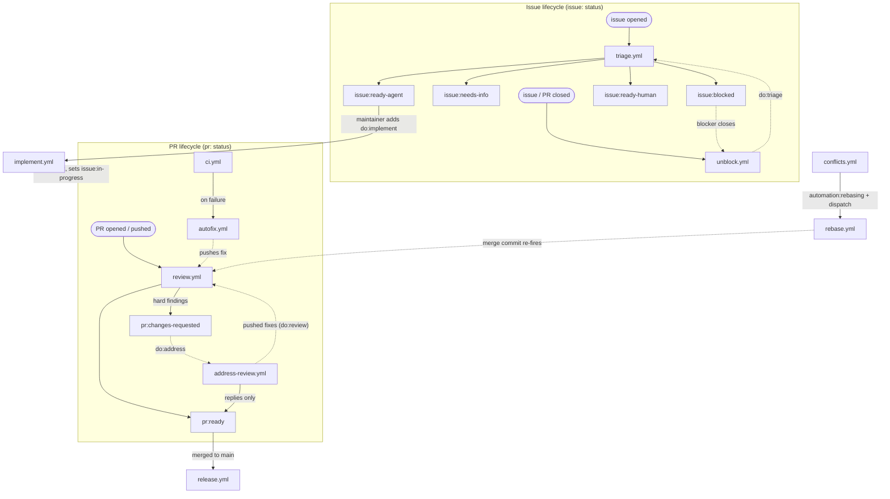

# Automation workflows

The `.github/workflows/` App automations drive an issue → PR → merge pipeline: an issue is triaged, an agent implements it on a branch, the PR is reviewed and its feedback addressed, CI is kept green, and merge-conflicts are rebased away — each step handed off to the next through **labels**.

This README owns the cross-cutting machinery: the pipeline shape, the lifecycle label model, and the protocols that several workflows share. Each workflow file keeps only its own local rationale and points here for the shared parts. The label taxonomy and the "status never triggers" rule are decided in [ADR-0029](../../docs/adr/0029-namespaced-label-taxonomy.md) and [ADR-0030](../../docs/adr/0030-label-status-vs-triggers.md) — this doc describes how the workflows implement them, not why the rules exist.

## The pipeline

Descriptive (non-lifecycle) labels — `type:`, `area:`, `size:`, `codec:`, `changeset:` — are applied in parallel by `issue-labels.yml` / `pr-labels.yml` and never gate the pipeline.

## Lifecycle labels

Every label is either a **status** (bot-maintained, descriptive, single-select by convention, **never** triggers a workflow) or a **trigger** (the `do:*` namespace, an explicit imperative the workflow it starts **consumes**). No status label appears in any workflow's `labeled` filter — a CI lint (`label-trigger-lint.mjs`) enforces this. See ADR-0030 for the full argument.

| Namespace | Owner | Values |
| --- | --- | --- |
| `issue:` | triage / implement / unblock | `triage` `needs-info` `ready-agent` `ready-human` `in-progress` `blocked` `wontfix` |
| `pr:` | review / address-review | `reviewing` `changes-requested` `addressing-feedback` `ready` `outdated` |
| `automation:` | conflicts / rebase | `rebasing` (the pause-mutex below) |
| `do:*` | maintainer / handoffs | `triage` `implement` `review` `address` `rebase` (consumed on start) |
| flat | escalation / loop cap | `needs-human`, `auto-round:N` |

Single-select is enforced the way ADR-0029 describes: the owning workflow removes the other values of a namespace when it sets one (`set_pr_status` / `set_issue_status` in `scripts/lifecycle-status.sh`).

## Shared protocols

### Start/stop labelling contract

Each workflow owns its status namespace and follows ADR-0030's contract:

- **On start** — remove the `do:*` trigger that fired it; set the in-progress status (`pr:reviewing`, `pr:addressing-feedback`, `issue:in-progress`, …).
- **On stop** — clear the in-progress status; set the outcome (`pr:ready` / `pr:changes-requested`) or hand off the next `do:*` trigger.

A workflow that **defers** without doing its work (see the pause-mutex below) must also clear any in-progress status a superseded run left behind, so a PR is never stranded mid-lifecycle.

### The `automation:*` rebase pause-mutex

While a conflict-rebase is in flight, `conflicts.yml` marks the PR `automation:rebasing`. The current head commit is about to be superseded by the rebase merge commit, so **every PR-triggered workflow pauses while any `automation:*` label is present** — it reports success without acting (`ci` cancels its run; `bench` skips via a read-only guard job; `review`, `address-review`, `autofix` no-op) and lets the rebase merge commit re-fire the work on the new SHA. `rebase.yml` clears the mutex **early**, before pushing that commit, so the re-fired runs see a clean state. This generalises the old magic-word `conflicting` check into a namespace check.

Workflows implementing the pause: `ci`, `bench`, `autofix`, `review`, `address-review` (and `conflicts` / `rebase` / `labels` reference it).

### Producer / poster split

The agent (`anthropics/claude-code-action`) steps are pure **producers**: they read a precomputed context directory and **write their intended output to files**, making **zero** GitHub mutations. A separate deterministic **poster** step reads those files and performs every mutation, with `jq` doing all JSON encoding from raw body files so bodies can't be corrupted by shell quoting. This keeps the agent hermetic and the mutations auditable. Workflows using it: `triage`, `implement`, `review`, `address-review`, `autofix`.

Where pushing is involved (`implement`, `address-review`), the split is **enforced**: the working checkout uses `persist-credentials: false` and the producer gets a read-only token (or none), so it literally cannot push — only the poster, which re-establishes a one-shot token-in-URL credential (`push_branch` in `scripts/poster-lib.sh`), can.

### App token & the read/write security split

Jobs mint a short-lived GitHub App token (`actions/create-github-app-token` / `./.github/actions/app-token`) scoped to least privilege. Workflows that run untrusted PR/review text through an agent mint **two** tokens — a write token for the deterministic steps and a separate **read-only** token for the producer — because `claude-code-action` wires its `github_token` into the agent's git/gh auth. The write/read-only split is the security boundary and is never collapsed into one token.

### Provisioning workflow helpers from main

Jobs that check out an agent/PR branch resolve local actions (`./.github/actions/*`) and scripts (`.github/scripts/*`) from that branch's tree. A branch that predates a helper lacks it, so these jobs fetch the missing helpers from `main` and extract them as **untracked, git-ignored** files — on disk for `uses:`/`bash`, never staged into the agent's commits. Workflows doing this: `review`, `address-review`, `rebase`, `autofix`.

## Workflow index

| File | Trigger | Role |
| --- | --- | --- |
| `triage.yml` | issue opened/reopened, `do:triage` | Classify an issue; set `issue:` status + post triage comment |
| `implement.yml` | `do:implement` | Agent implements a ready issue on `agent/issue-N`, opens the PR |
| `review.yml` | PR opened/sync, `do:review` | Post the two-axis code review; set `pr:` status; flag `do:address` on hard findings |
| `address-review.yml` | `do:address` | Agent addresses review feedback, pushes fixes, hands off `do:review` / `pr:ready` |
| `autofix.yml` | CI run completed (failure) | Agent fixes a failing agent-PR CI run |
| `conflicts.yml` | push to `main`, PR opened | Detect conflicts; set `automation:rebasing`; dispatch the rebase |
| `rebase.yml` | `do:rebase`, dispatch | Rebase an agent PR onto `main`; clear the mutex; push the merge commit |
| `unblock.yml` | issue/PR closed | Re-triage issues whose blockers are all closed (`do:triage`) |
| `release.yml` | push to `main` | Changesets versioning / publish |
| `ci.yml` | PR, push to `main` | Lint, typecheck, test, depcruise, build |
| `ci-peer-floors.yml` | PR | Verify adapter peer-dependency floor versions |
| `bench.yml` | PR, push to `main` | Run benchmarks (PR) / warm the per-CPU-model base bench cache (push) |
| `issue-labels.yml` / `pr-labels.yml` | issue/PR opened/edited/sync | Apply descriptive (`type:`/`area:`/`size:`/…) labels |
| `labels.yml` | push to `main`, dispatch | Reconcile the label definitions (names, colours, descriptions) |
| `backfill-labels.yml` | dispatch | One-time namespaced-label backfill (ADR-0029 migration) |
| `docs.yml` / `docs-coverage.yml` | push, schedule, PR | Build the docs site / check automation-doc coverage |
| `gitleaks.yml` / `scorecard.yml` | PR, schedule | Secret scanning / OpenSSF scorecard |
| `pr-title.yml` | PR opened/edited | Enforce conventional-commit PR titles |
